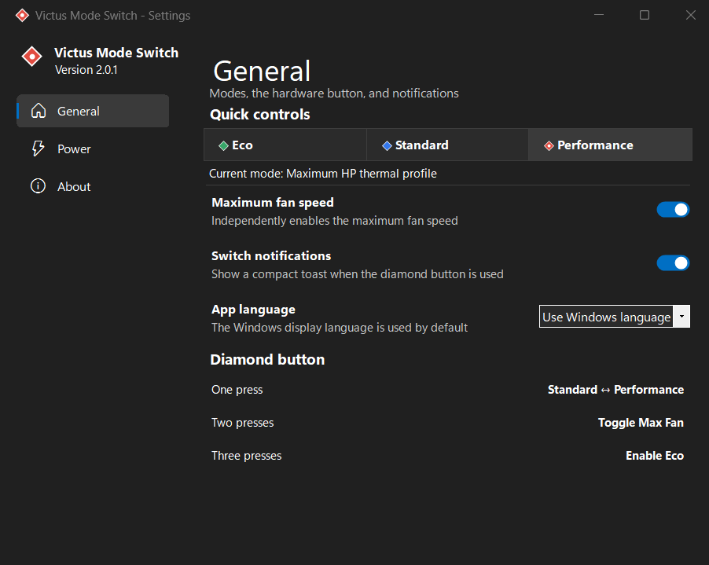
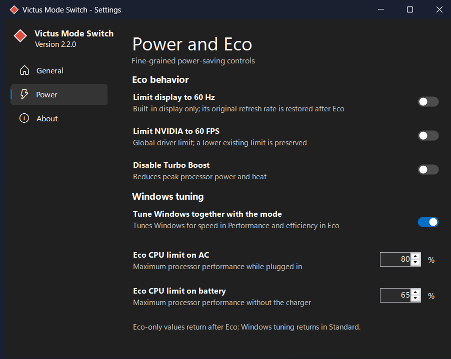

<p align="center">
  
</p>

<h1 align="center">Victus Mode Switch</h1>

<p align="center">
  A lightweight Windows 11 tray app that replaces the basic performance controls of OMEN Gaming Hub.
</p>

<p align="center">
  <a href="https://github.com/Juanbod/VictusModeSwitch/actions/workflows/build.yml"></a>
  <a href="https://github.com/Juanbod/VictusModeSwitch/releases/latest"></a>
  <a href="LICENSE"></a>
</p>

> [!CAUTION]
> This project was developed with AI assistance and tested on a single laptop. It calls an undocumented HP BIOS interface. Installation and use are entirely at your own risk. Read the [full disclaimer](DISCLAIMER.md) before installing.

[Русская версия](docs/README.ru.md)



## What it does

- One diamond-button press switches between **Standard** and **Performance**.
- Two quick presses toggle **Max Fan**.
- Three quick presses enable **Eco**.
- The tray menu provides direct, silent mode selection.
- The settings UI follows the Windows light/dark theme and supports English, Russian, Ukrainian, or the Windows display language.
- Optional Windows power tuning adjusts CPU, cooling, PCIe, Wi-Fi, and USB power preferences and restores the original values in Standard mode.
- The built-in updater checks GitHub Releases and verifies the installer SHA-256 checksum before it can run.

Holding the diamond button cannot be detected reliably on the tested laptop. Its firmware emits one WMI pulse without a release or repeat event, so Eco uses a triple press.

## Supported hardware

The current safety allowlist contains only:

| Device | Required value |
|---|---|
| Tested model | HP Victus 15-fa0020ua |
| System board | `8A4F` |
| HP Thermal Policy | `V0` |

BIOS writes are blocked when the system board or thermal policy does not match. Similar Victus models are **not assumed compatible**. Open an issue with diagnostic information before proposing support for another board.

## Install

1. Download [`VictusModeSwitch-Setup.exe`](https://github.com/Juanbod/VictusModeSwitch/releases/latest/download/VictusModeSwitch-Setup.exe) and its [SHA-256 file](https://github.com/Juanbod/VictusModeSwitch/releases/latest/download/VictusModeSwitch-Setup.exe.sha256).
2. Verify the checksum:

   ```powershell
   (Get-FileHash .\VictusModeSwitch-Setup.exe -Algorithm SHA256).Hash
   Get-Content .\VictusModeSwitch-Setup.exe.sha256
   ```

3. Run the installer and read the hardware warning.
4. Approve the one-time UAC prompt used to validate the laptop, install the protected BIOS broker under `Program Files`, and register its short elevated task.

The release installer is currently **not code-signed**, so Windows may show an unknown-publisher warning. A SHA-256 checksum verifies download integrity but is not a replacement for Authenticode publisher verification.

The optional setup checkbox pauses OMEN Gaming Hub background helpers. OMEN Gaming Hub is not uninstalled, the HP Omen HSA hardware service remains available, and saved task/background states are restored on uninstall.

## Modes

| Mode | HP BIOS | Optional Windows tuning | Max Fan |
|---|---|---|---|
| Eco | Standard thermal policy | Best efficiency, configurable CPU limits, device power saving | Turns off when entering Eco |
| Standard | Standard thermal policy | Restores the captured Windows values | Preserved |
| Performance | Performance thermal policy | Best performance, CPU/EPP and device power saving tuned for speed | Preserved |

Max Fan can still be toggled independently after entering any mode.



## Updates and privacy

Automatic checks are enabled by default and run at most once per day against the public GitHub Releases API. There is no telemetry, account, analytics service, background polling loop, or embedded browser. Update installation always requires a user click.

For each update the app downloads the installer and checksum from the same GitHub Release, verifies SHA-256, exits fully, verifies the file again in a helper process, and only then starts setup.

## Architecture

- `.NET 10` Windows Forms, self-contained `win-x64` release
- HP WMI event listener for `EventID=29`, `EventData=8613`
- Per-user tray process with normal privileges
- Protected PowerShell broker under `Program Files`, launched without a console window, that accepts only fixed mode/fan requests and runs briefly at highest privileges
- Inno Setup per-user installer
- GitHub Actions build, tests, installer packaging, checksums, and Releases

Idle resource use on the tested system is approximately 15-25 MB of private memory and effectively zero CPU while waiting for events.

## Build

Requirements: Windows, [.NET 10 SDK](https://dotnet.microsoft.com/download/dotnet/10.0), and [Inno Setup 6](https://jrsoftware.org/isinfo.php).

```powershell
dotnet test .\VictusModeSwitch.slnx -c Release
.\scripts\Build-Release.ps1 -Version 2.0.2
```

Artifacts are written to `artifacts/`. For hardware diagnostics:

```powershell
.\artifacts\publish\VictusModeSwitch.exe --diagnose 20
```

Normal mode switching requires the installer-created protected broker task. Do not experiment with command IDs or remove the hardware allowlist on a machine you cannot afford to lose.

## Uninstall

Use **Settings > Apps > Installed apps > Victus Mode Switch > Uninstall**. Removal switches to Standard, disables Max Fan, restores captured Windows power values, removes the startup entry and elevated BIOS task, and restores saved OMEN background settings. User settings and logs remain in `%LOCALAPPDATA%\VictusModeSwitch` unless removed manually.

## License and notice

Source code is available under the [MIT License](LICENSE). The hardware disclaimer and limitation of liability still apply. This project is independent and is not affiliated with, endorsed by, or supported by HP.
